# davidliu.work

My personal site. A floating cutout of my head lives on it. It's an AI version of me, wired into my second brain (a condensed copy of the notes I keep in Obsidian), so it knows my stories, not just my resume. It talks to you, points at things, carries them around, and keeps the conversation going while you browse.

[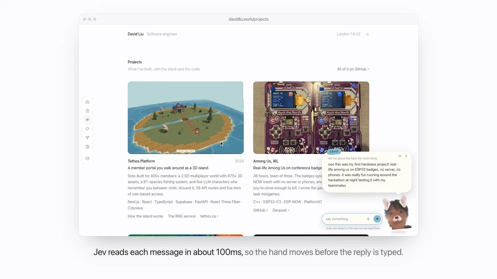](https://davidliu.work/docs/demo.mp4)

**[Watch the 75-second demo](https://davidliu.work/docs/demo.mp4)**

## What the head does

- **Knows me.** It's wired into my second brain. When it pulls from a note, the bubble says what it's recalling, and that note lights up on the map at `/brain/`.
- **Starts the conversation.** It waits for you to settle in, pops onto the page, introduces itself and asks your name.
- **Acts before it talks.** Every message goes through Jev first. In about 100ms it knows what you want, so the hand is already moving when the reply starts typing. Say you're a recruiter and it walks you to my resume and puts the PDF next to your cursor.
- **Picks things up.** The hand points at things, brings them to your cursor, and carries photos and project cards around before putting them back.
- **Eats things.** Drag anything on the page onto its face. It eats it, then tells you about it.
- **Notices you.** Open something or stop to read it and it says something about it, once. It also reacts to inspect element, right clicks, dark mode, leaving the tab, and getting thrown across the screen.
- **Gives tours.** "just lookin around" gets you a walk through every page.
- **Takes notes.** `/notes/` is a wall of sticky notes. Take one off the pad in the corner, write on it, and stick it wherever you want. It stays where you put it (Jev checks it first). Tell the head you want to leave me a private note and it passes it on instead. Either way I get a ping on Telegram.
- **Pitches the games.** Nothing on a hobby page has a start button. You see the photos first, then the head dims the page, comes right up to the screen and asks: spar me? climb with me? rally me with the Astrox 88D? Say yes and it flies straight into the ring or onto the wall. Say later and clicking it on that page asks again. Tell it to go away and the pages get their own buttons back.
- **Keeps you exploring.** Twelve things to do (spar it, rally it, climb the page, play the guitar, call the cat, leave a note, message me...) live behind the star in the header. Doing one checks it off and a toast says what's next, a little note under the star nudges you once a visit, and if your mouse heads for the tab bar, the head names one you missed.
- **Can't be talked out of being me.** Prompt injection and trolls get caught by Jev before they reach the brain.
- **Answers fast.** First word in under a second.

It's supposed to feel like I'm there, not like a chatbot in the corner. So it doesn't push: one check-in if it gets quiet, and it only drags things to your cursor when you ask, or when you're clearly a recruiter and it's the resume.

## Screenshots

| | |
|---|---|
| 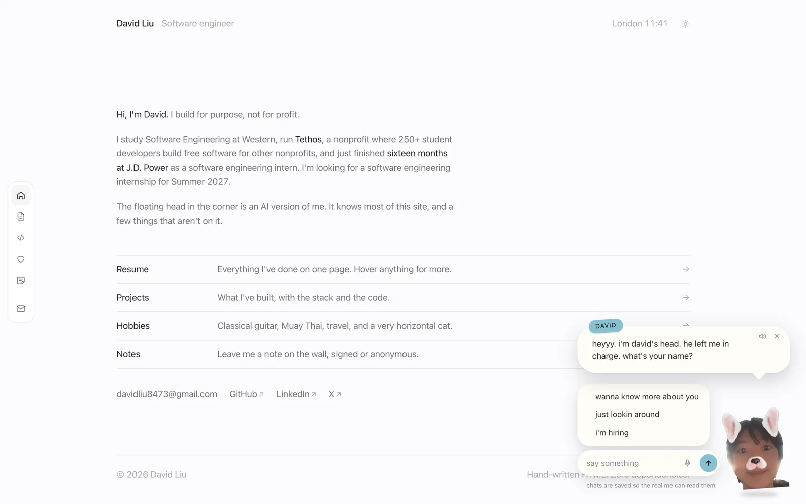 | 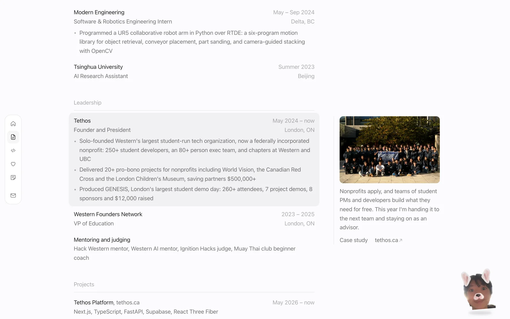 |
| The head says hi on your first visit. | The resume. Hover any entry and a note opens in the margin. |
| 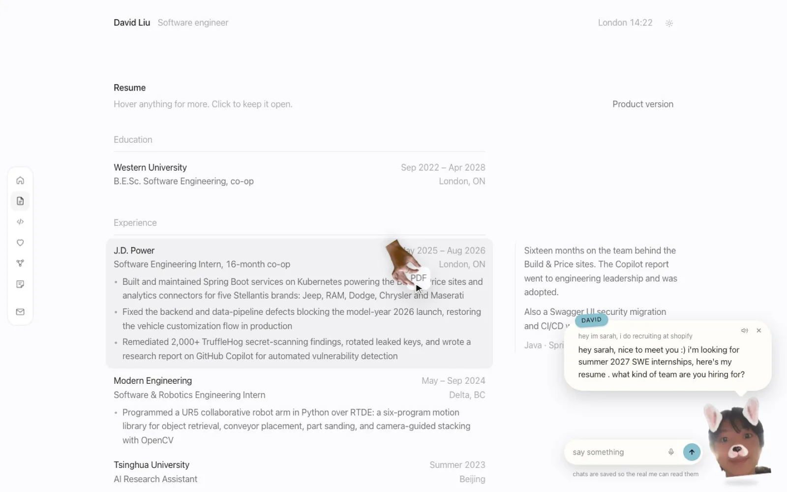 | 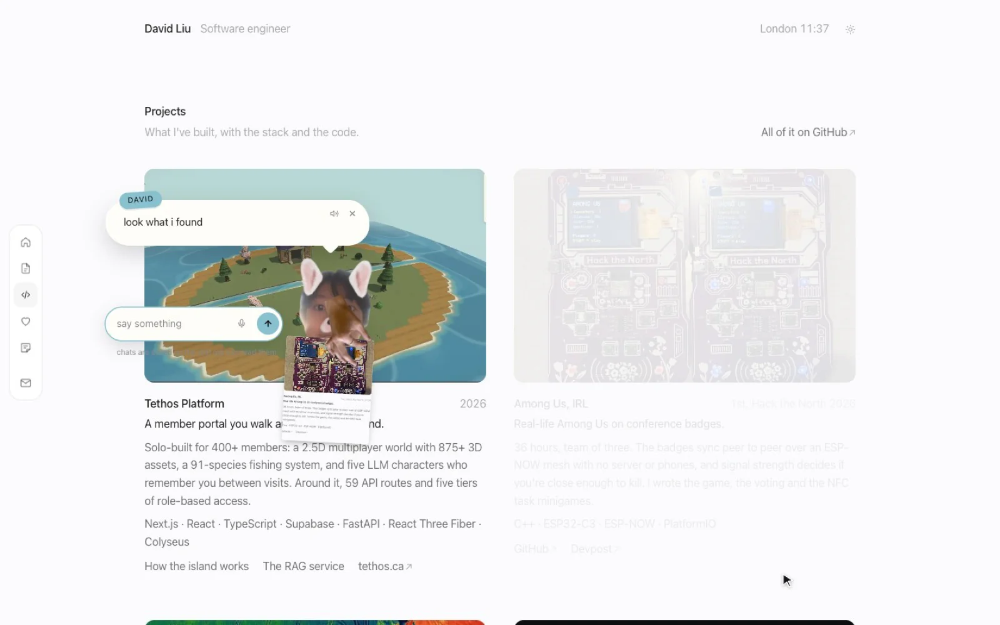 |
| The hand brings the resume to your cursor. | Carrying a project card around. |
| 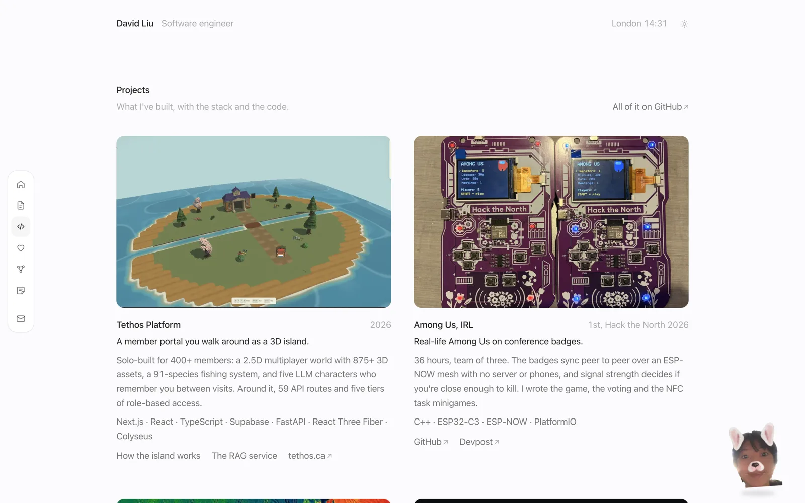 | 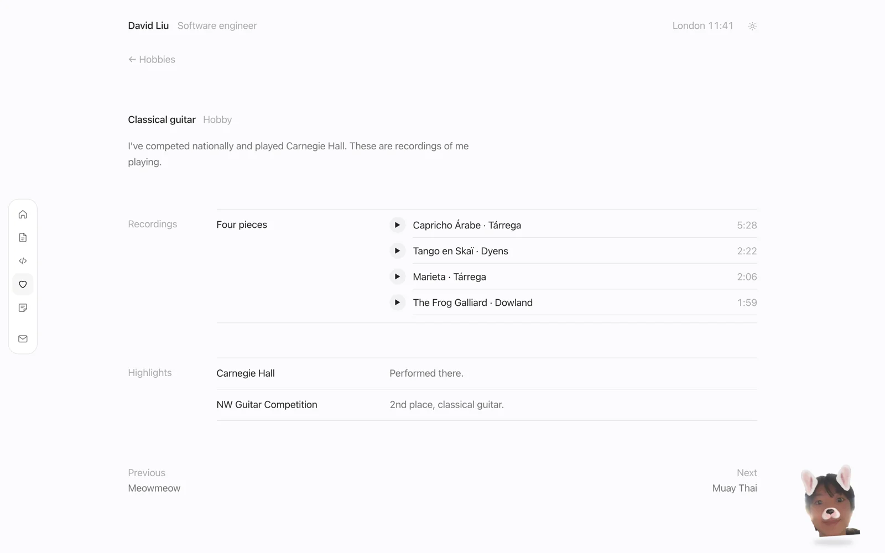 |
| Projects, with the stack and the code. | Recordings keep playing while you browse. |
| 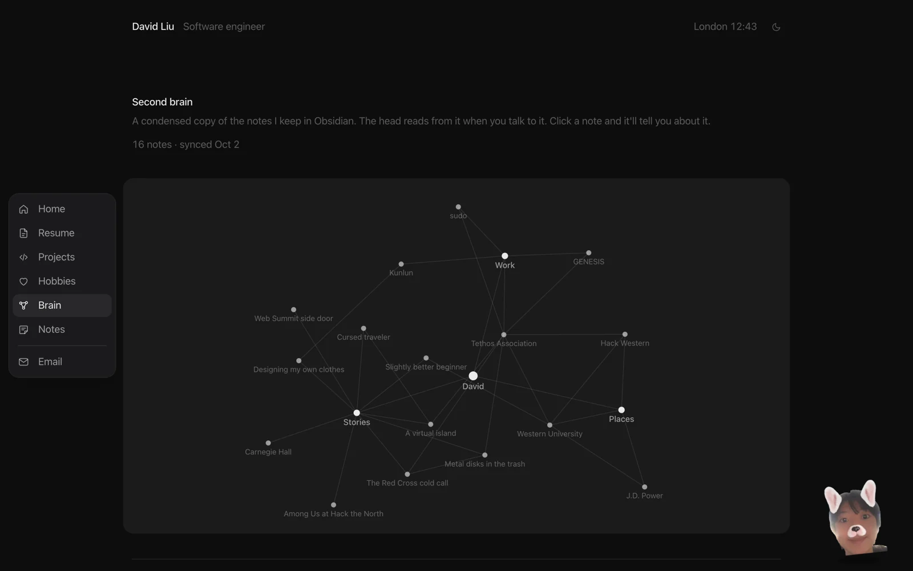 | 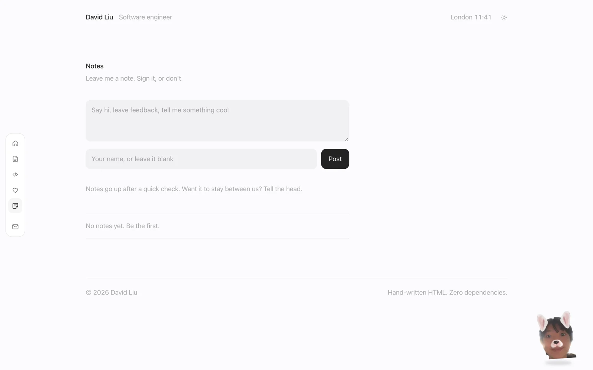 |
| The second brain, as a map. Drag it around, click to see what connects. | The note wall, with sample notes, each where someone stuck it. Click one to read it up close. |
| 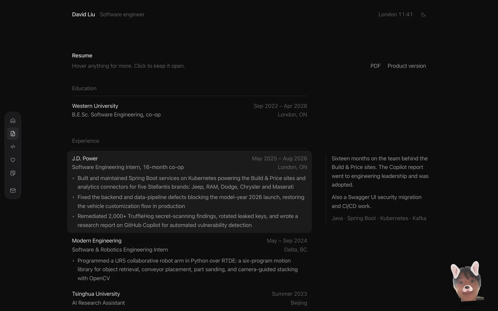 | |
| Dark mode. | |

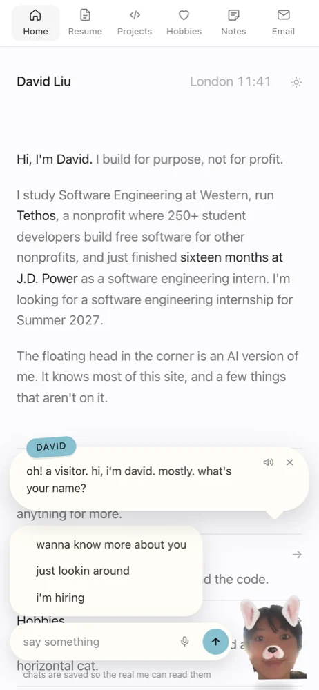

## How it works

The site is served by GitHub Pages. Pages swap in place instead of reloading, so the head stays mid-conversation and the music keeps playing.

The head talks to a few small functions on Vercel. The models all go through OpenRouter:

| Model | Job |
|---|---|
| **Jev** (`typesafe/jev-1.13`) | Fast typed decisions. Reads every message (troll or not, what you want, which thing on the site it's about, who you are, which notes to recall), picks the head's next move while you browse, and screens public notes. About 100ms, fractions of a cent. |
| **DeepSeek V4.1 Flash** (`deepseek/deepseek-v4.1-flash`) | Writes the replies, in my voice, with reasoning off. First word in under a second, about $0.0002 a reply. |
| **GPT-6.1 Sol** (`openai/gpt-6.1-sol`) | Backup. Takes the reply if DeepSeek errors or comes back empty. |

I picked the brain by racing 11 models through the real chat function (my rules, persona and notes, Jev in front) on recruiter intros, my stories, a friends-only story asked by a recruiter, GPA, "are you an AI?", and off-topic requests. Several cheap models made up travel details. DeepSeek V4.1 Flash never did, followed every rule, and was the fastest and cheapest. Requests only go to hosts that don't train on what they're sent. `BRAIN_MODEL` and `BRAIN_REASONING` swap it without a code change.

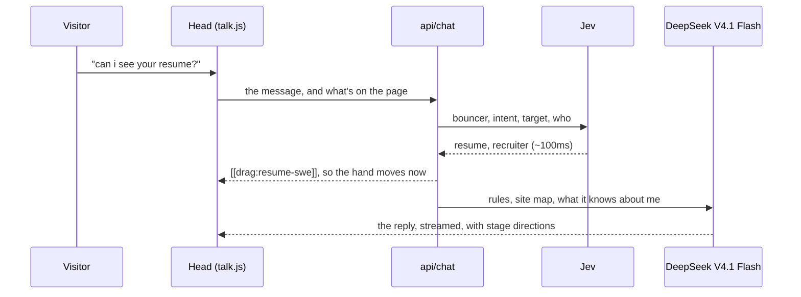

Replies stream as plain text with stage directions inline. The page acts them out when the typewriter gets to them:

| Marker | What happens |
|---|---|
| `[[point:ID]]` | The hand flies over and taps it, walking to another page first if it has to. |
| `[[drag:ID]]` | The hand brings it to your cursor. |
| `[[carry:ID]]` | The head picks it up and floats around with it. |
| `[[face:happy]]` | My photo morphs into that face. Also `sad` and `angry`. |
| `[[summon:cat]]` | My cat walks in from the edge of the screen and lies down. |
| `[[note:key=value]]` | Remembers something you told it. Never shown. |
| `[[mode:note]]` | Takes a private note for me. `[[mode:tour]]` starts the tour. |

IDs come from `talk/targets.json`, hooked into the pages with `data-t`.

What the head knows about me isn't in this repo. It gets loaded when the function starts.

### The second brain

I keep my notes in Obsidian. `tools/brain/sync.mjs` reads the notes I've picked (a list that lives outside the repo), condenses each one, and writes two things:

- the private copy the head reads from, uploaded to Vercel as `DAVID_CORTEX`
- `brain/graph.json`: each note's title, one line, and how the notes connect

Condensing keeps my words and drops anything that shouldn't leave the vault: other people's names, contact details, internal stuff. Some stories are marked friends-only, and the head keeps those away from recruiters.

```bash
OPENROUTER_API_KEY=... node tools/brain/sync.mjs   # condense
node tools/brain/sync.mjs push                       # upload, then redeploy
```

`/brain/` draws everything as one graph, Obsidian style. `brain/map.json` is the tree (me, then topics like projects, leadership and hobbies, then what's under each, down to single facts) plus the cross links, like which skills went into which project. The synced notes hang off it by id, so a note the head recalls lights up in place. Big nodes are topics, small ones are stories and facts. Drag nodes or the canvas, scroll or pinch to zoom, click a node to see what it touches, double click to ask the head about it.

Every note is in the head's instructions (cached, so it's cheap). For each message, Jev picks the notes that fit, the page shows "recalling", and the brain leans on them.

### Spend

Replies cost money, so there's a monthly cap in the chat function (default $20, after which the head falls back to its own lines), per-IP limits, 25 messages per visit, and a credit limit on the OpenRouter key as the backstop. The head's own lines (comments, the tour, notes, the bouncer) never touch the brain.

## Repo

| Path | What's in it |
|---|---|
| `index.html`, `resume/`, `projects/`, `hobbies/`, `brain/`, `notes/` | The pages |
| `tethos/`, `dashboard/`, `rag/`, `kunlun/` | Case studies |
| `styles.css` | The whole site's styles. One typeface, hierarchy by opacity. |
| `site.js` | Page swaps, the guitar player, resume notes, hover photos, the note wall, the brain map, the things to do (`FINDS`) |
| `talk/talk.js`, `talk/talk.css` | The head, the hand, the cat, and everything they do |
| `LINES` in `talk/talk.js` | Every line the head says on its own |
| `talk/targets.json` | Everything the head can point at |
| `brain/` | The second brain page. `map.json` is the graph, `graph.json` the synced notes |
| `tools/build.py` | Writes the pages (home, resume, projects, every hobby, brain, notes). Edit it, then `python3 tools/build.py` |
| `tools/brain/sync.mjs` | Condenses my Obsidian notes into the second brain |
| `api/chat.js` | The conversation: Jev first, then the brain, streamed |
| `api/decide.js` | Jev picks the head's next move |
| `api/note.js`, `api/wall.js` | Notes for me (sent to my Telegram), and the public wall |
| `api/visit.js` | Page-view beacon |
| `supabase/visitors.sql` | Visitors, chats, notes, and the spend counter |
| `tools/cutout.swift` | Cuts my head, hands and cat out of photos with Apple's Vision framework |
| `tools/voice.html` | Records letters for the head's voice |

## Run it locally

```bash
python3 -m http.server 8000
```

Open http://localhost:8000. Everything works except the brain, so the head sticks to its own lines. For the brain, run `npx vercel dev` with the environment variables below.

## Deploy

The site deploys through GitHub Pages on push. The functions in `api/` run as the Vercel project `davidliu-work`:

```bash
npx vercel deploy --prod
```

| Environment variable | What it's for |
|---|---|
| `OPENROUTER_API_KEY` | Every model |
| `BRAIN_MODEL`, `BRAIN_REASONING` | Optional. Default `deepseek/deepseek-v4.1-flash` with reasoning `off` |
| `DAVID_BRAIN` | What the head knows about me |
| `DAVID_CORTEX` | The second brain, from `tools/brain/sync.mjs push` |
| `SUPABASE_URL`, `SUPABASE_SECRET_KEY` | Visitor memory, chat logs, notes and the spend counter. Use a dedicated Supabase project and run `supabase/visitors.sql` in it once. |
| `TELEGRAM_BOT_TOKEN`, `TELEGRAM_CHAT_ID` | Messages me on Telegram when someone leaves a note |
| `MONTHLY_CAP_USD` | Optional, defaults to 20 |

If the project URL changes, update `API` at the top of `talk/talk.js` and `site.js`.

## New photos

```bash
swift tools/cutout.swift head photo.jpg media/head.webp
swift tools/cutout.swift hand point.jpg media/hands/point.webp point
```

Each prints a config to paste into `HEAD`, `HANDS` or `PET` at the top of `talk/talk.js`. Needs `brew install webp`.
